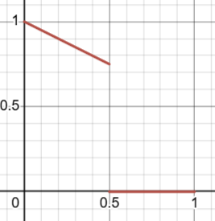
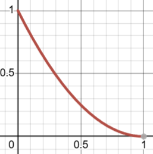
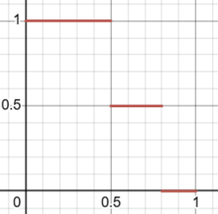

# 2026-03-10 Expression masks considerations

## Converter script update

I was able to convert VRM expressions’ overrides into KHR_character_expression_mask successfully in my converter script.

https://github.com/0b5vr/khr-character-testbed/tree/main/converter

Below is an example of the generated JSON for the "happy" expression, which is converted from VRM expression with `overrideBlink` and `overrideMouth` properties.

```json
{
  "extensions": {
    "KHR_character_expression": {
      "expressions": [
        // ...
        {
          "expression": "happy",
          "animation": 6,
          "extensions": {
            "KHR_character_expression_morphtarget": {
              "channels": [
                0
              ]
            },
            "KHR_character_expression_mask": {
              "masks": [
                {
                  "target": "blink",
                  "type": "blend"
                },
                {
                  "target": "blinkLeft",
                  "type": "blend"
                },
                {
                  "target": "blinkRight",
                  "type": "blend"
                },
                {
                  "target": "aa",
                  "type": "blend"
                },
                {
                  "target": "ih",
                  "type": "blend"
                },
                {
                  "target": "ou",
                  "type": "blend"
                },
                {
                  "target": "ee",
                  "type": "blend"
                },
                {
                  "target": "oh",
                  "type": "blend"
                }
              ]
            }
          }
        },
        // ...
      ]
    }
  }
}
```

## Feedback from VRM Consortium
The idea of “amount” and “threshold” was also accepted by the VRM Consortium 😄

However, there are some concerns about the spec.
I'm open for discussion and feedback from you about the following points.

### Confusion about "amount"
The "amount" spec is confusing even for VRM Consortium pals.

other property candidates:

- `amount` : apparent that 0 nullifies the effect. unintuitive algorithm; difficult to explain
- `weight` : 0 probably nullifies the effect. same unintuitiveness as `amount`
- `maximum` : apparent that 1 nullifies the effect. unintuitive that it takes the total product of `maximum` values when two or more masks are effective
- `attenuation` : can’t predict how the parameter affects

### Naming of "type"
I would want to pick a most appropriate naming for `type`:

- current: `blend` , `block` . align with VRM spec
- candidate: `linear` , `step` . align with glTF animations
- Having a user-defined expression (I mean, a formula) for the mask effect is also an option, but it may be too much for this phase.

### Multiple masks targeting the same expression
Is it possible to let an expression have two or more masks targeting the same expression?

- Have both blend and block to achieve a complex control
  ```json
  "masks": [
    { "target": "aa", "type": "blend", "amount": 0.5 },
    { "target": "aa", "type": "block", "threshold": 0.5 }
  ]
  ```
  
- Have two blends to achieve a quadratic curve
  ```json
  "masks": [
    { "target": "aa", "type": "blend" },
    { "target": "aa", "type": "blend" }
  ]
  ```
  
- Have two blocks to achieve a CSS steps() like control
  ```json
  "masks": [
    { "target": "aa", "type": "block", "threshold": 0.5, "amount": 0.5 },
    { "target": "aa", "type": "blend", "threshold": 0.8 }
  ]
  ```
  
